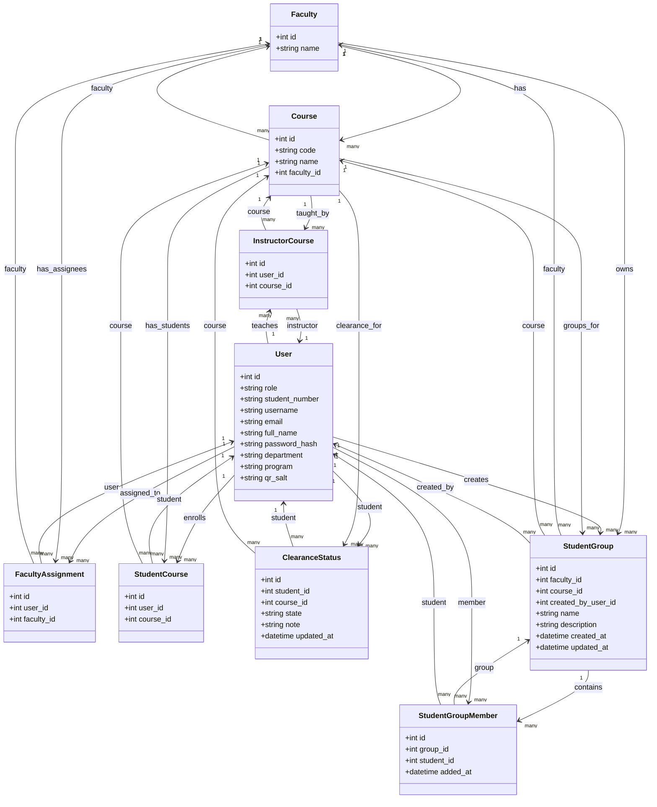

# Class Diagram (Database Models)

Excludes: `event`, `event_clearance`, `event_enrollment`, `semester`, `faculty_user_role`, `default_assignatory`.

```mermaid
classDiagram
    class Faculty {
        +int id
        +string name
    }

    class Course {
        +int id
        +string code
        +string name
        +int faculty_id
    }

    class User {
        +int id
        +string role
        +string student_number
        +string username
        +string email
        +string full_name
        +string password_hash
        +string department
        +string program
        +string qr_salt
    }

    class FacultyAssignment {
        +int id
        +int user_id
        +int faculty_id
    }

    class InstructorCourse {
        +int id
        +int user_id
        +int course_id
    }

    class StudentCourse {
        +int id
        +int user_id
        +int course_id
    }

    class ClearanceStatus {
        +int id
        +int student_id
        +int course_id
        +string state
        +string note
        +datetime updated_at
    }

    class StudentGroup {
        +int id
        +int faculty_id
        +int course_id
        +int created_by_user_id
        +string name
        +string description
        +datetime created_at
        +datetime updated_at
    }

    class StudentGroupMember {
        +int id
        +int group_id
        +int student_id
        +datetime added_at
    }

    %% Relationships (based on app/models.py)
    Faculty "1" --> "many" Course : has
    Faculty "1" --> "many" StudentGroup : owns

    User "1" --> "many" FacultyAssignment : assigned_to
    Faculty "1" --> "many" FacultyAssignment : has_assignees

    User "1" --> "many" InstructorCourse : teaches
    Course "1" --> "many" InstructorCourse : taught_by

    User "1" --> "many" StudentCourse : enrolls
    Course "1" --> "many" StudentCourse : has_students

    User "1" --> "many" ClearanceStatus : student
    Course "1" --> "many" ClearanceStatus : clearance_for

    User "1" --> "many" StudentGroup : creates
    Course "1" --> "many" StudentGroup : groups_for

    StudentGroup "1" --> "many" StudentGroupMember : contains
    User "1" --> "many" StudentGroupMember : member

    %% Foreign-key style edges (helps readability)
    Course "many" --> "1" Faculty : faculty
    FacultyAssignment "many" --> "1" User : user
    FacultyAssignment "many" --> "1" Faculty : faculty
    InstructorCourse "many" --> "1" User : instructor
    InstructorCourse "many" --> "1" Course : course
    StudentCourse "many" --> "1" User : student
    StudentCourse "many" --> "1" Course : course
    ClearanceStatus "many" --> "1" User : student
    ClearanceStatus "many" --> "1" Course : course
    StudentGroup "many" --> "1" Faculty : faculty
    StudentGroup "many" --> "1" Course : course
    StudentGroup "many" --> "1" User : created_by
    StudentGroupMember "many" --> "1" StudentGroup : group
    StudentGroupMember "many" --> "1" User : student
```

