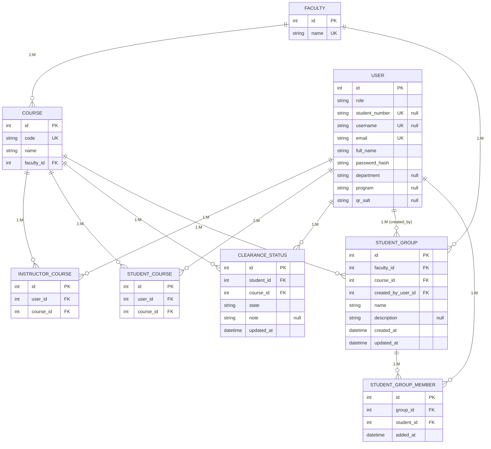
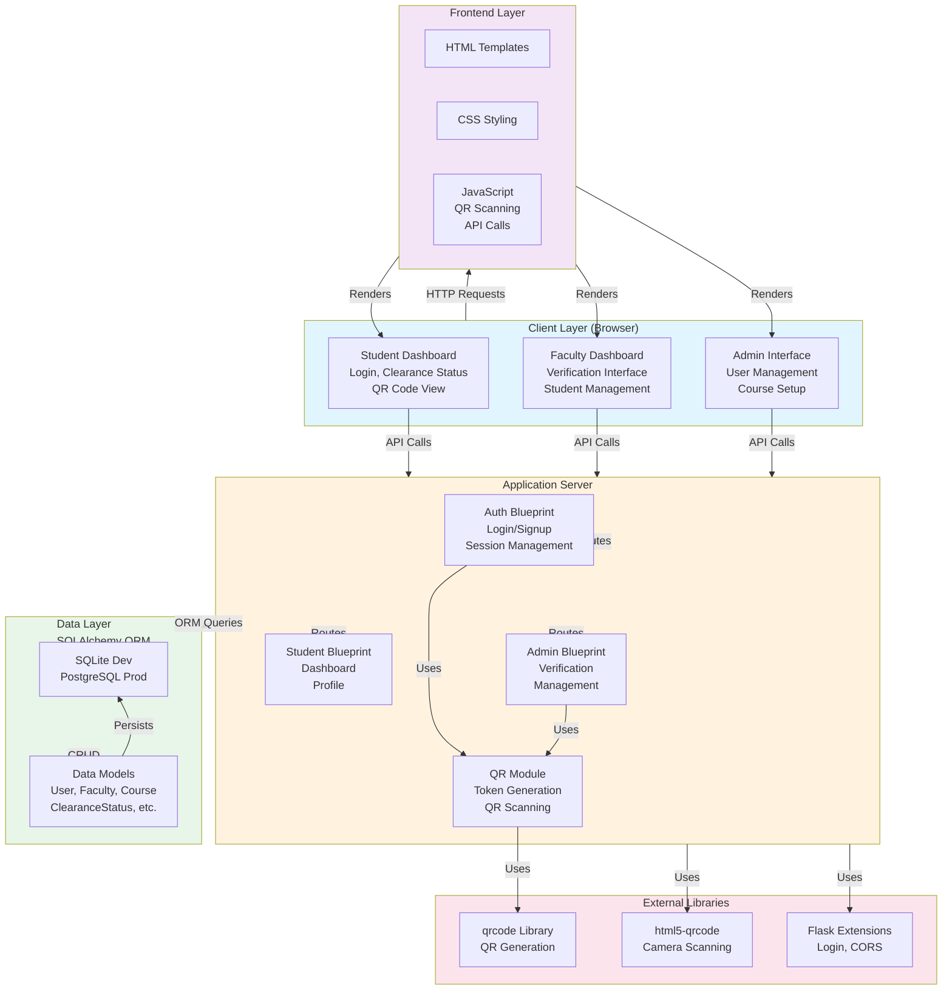
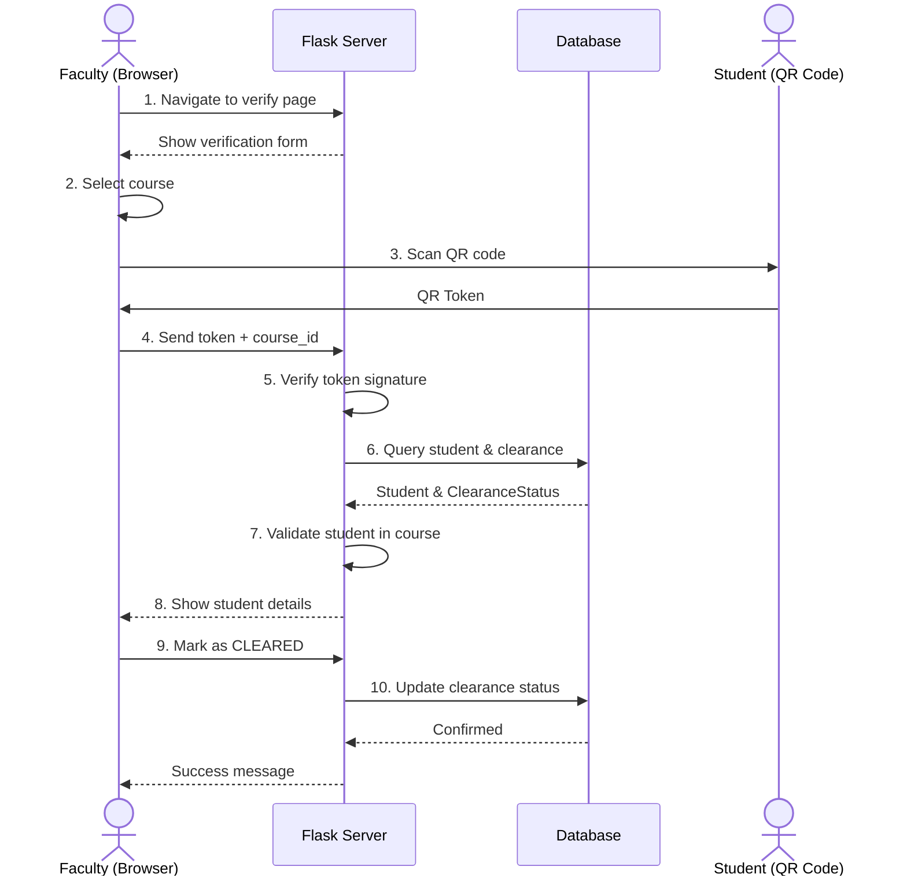
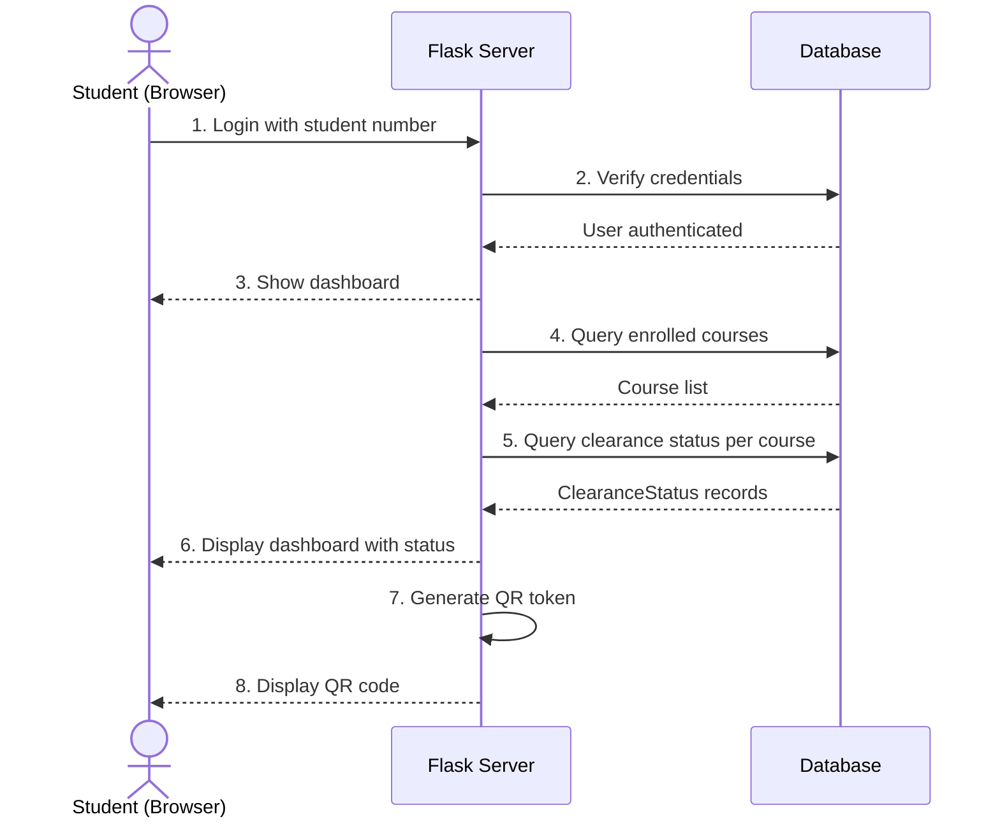
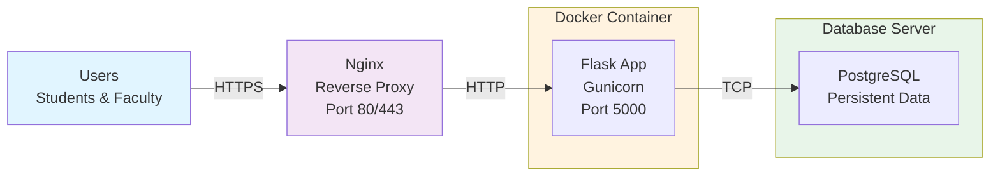
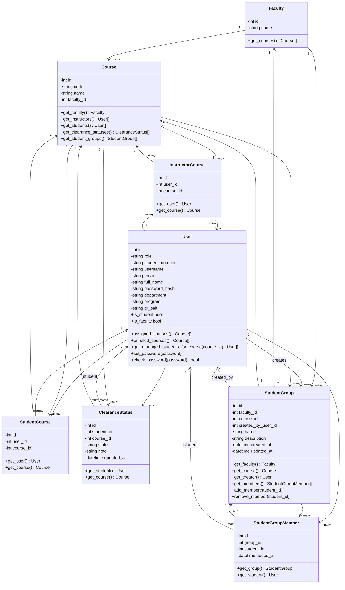

# Database Entity-Relationship Diagram

## Excluded Entities
- `FACULTY_ASSIGNMENT` - Junction table for faculty user assignments
- `FACULTY_USER_ROLE` - Junction table for multiple faculty roles per user per faculty
- `EVENT` - Event model
- `EVENT_CLEARANCE` - Event clearance model
- `EVENT_ENROLLMENT` - Event enrollment model
- `SEMESTER` - Semester model

---

# System Analysis & Requirements

## 1. TARGET USERS

### Primary Users
1. **Students (BS Computer Science)**
   - Need to complete clearance requirements before graduation
   - Must visit multiple offices/departments to obtain approvals
   - Want to track their clearance status in real-time

2. **Faculty/Office Staff (Multi-role)**
   - **Instructors**: Verify student clearance for specific courses
   - **Coordinators**: Manage student clearances across multiple courses
   - **Deans**: Oversee all clearances in their faculty
   - Need to verify and mark students as cleared or blocked

3. **Administrator**
   - System setup, configuration, user management
   - Database migration and maintenance

### Secondary Users
- Course coordinators for event management
- Department heads for reporting

---

## 2. PROBLEM STATEMENT

### Existing Challenges (Manual Process)
1. **Manual Verification Process**
   - Students manually visit each office with physical documents
   - Offices maintain paper-based records or unconnected spreadsheets
   - High error rates, duplicate entries, lost documents

2. **Lack of Real-time Status Tracking**
   - Students cannot track their clearance progress
   - Offices have no unified view of student clearance statuses
   - Leads to missed deadlines and confusion

3. **Scalability Issues**
   - Cannot efficiently handle multiple departments/offices
   - No centralized clearance management system
   - Difficult to generate reports for graduating students

4. **Inefficiency in Course-Based and Event-Based Clearances**
   - Need to separately track clearances for courses and events (e.g., sportfest, CCS week)
   - No system to manage events within courses
   - Faculty members with multiple roles cannot manage different types of clearances

5. **Data Security & Isolation Concerns**
   - No proper isolation between different faculties' data
   - Students could be added to multiple groups across different faculties inappropriately
   - Per-course verification not enforced (students verifiable for courses not enrolled in)

---

## 3. OBJECTIVES

### Functional Objectives
1. **Digital Clearance Management**
   - Replace manual, paper-based clearance process with digital system
   - Enable online verification and status tracking

2. **QR Code-Based Verification**
   - Generate unique, secure QR codes per student
   - Enable quick scanning and verification by office staff
   - Support both QR scanning and manual token entry

3. **Multi-Role Faculty Management**
   - Support instructors, coordinators, and deans with different permissions
   - Allow faculty members to have multiple roles per faculty
   - Separate course-based and event-based clearance tracking

4. **Real-time Status Dashboard**
   - Students view their clearance status for all courses/offices
   - Faculty view and manage clearance for their students
   - Centralized clearance overview

5. **Student Grouping & Batch Management**
   - Create student groups/blocks for efficient batch verification
   - Manage per-course isolation (groups tied to specific courses)
   - Prevent cross-faculty and cross-course group conflicts

### Non-Functional Objectives
1. **Security**
   - Secure QR token generation and verification
   - Role-based access control (RBAC)
   - Data isolation per faculty and course

2. **Scalability**
   - Support multiple faculties and courses
   - Handle hundreds of concurrent students and staff

3. **Usability**
   - Simple, intuitive web interface
   - Mobile-friendly for QR scanning
   - Fast verification workflow

4. **Maintainability**
   - Modular architecture (blueprints)
   - Database migrations for schema updates
   - Clear separation of concerns

---

## 4. SYSTEM ANALYSIS

### 4.1 Existing System (Current Implementation)

#### Core Components
1. **Authentication System**
   - Student login: student number + password
   - Faculty login: username + password
   - Role-based access (STUDENT vs FACULTY)

2. **Data Models**
   - **Faculty**: Represents departments (e.g., CS Dept, Library, Registrar)
   - **Course**: Courses within faculties
   - **User**: Students and faculty with role-based distinctions
   - **ClearanceStatus**: Tracks clearance state per student per course
   - **StudentGroup**: Groups/blocks of students for batch management
   - **InstructorCourse / StudentCourse**: Junction tables for assignments

3. **QR System**
   - Server-side QR code generation per student
   - Secure token-based verification
   - Support for camera-based and manual verification

4. **Verification Workflow**
   - Faculty selects course, scans/enters student QR token
   - System looks up student, displays clearance status
   - Faculty marks as CLEARED, BLOCKED, or leaves PENDING

5. **Multi-Role System**
   - FacultyUserRole table for multiple roles per faculty
   - Support for INSTRUCTOR, COORDINATOR, DEAN roles
   - Event-based clearance for special activities

#### Technology Stack
- **Backend**: Python + Flask
- **Database**: SQLAlchemy ORM (SQLite for dev, PostgreSQL for production)
- **Frontend**: HTML5/CSS3 + Vanilla JavaScript
- **QR Code**: `qrcode` library (server-side) + `html5-qrcode` (client-side scanning)
- **Deployment**: Docker, Gunicorn, Nginx

---

### 4.2 Identified Problems

#### 1. **Data Isolation Vulnerabilities** ✓ (FIXED)
- **Issue**: Students could be added to groups across different faculties inappropriately
- **Impact**: Data integrity violation, incorrect clearance tracking
- **Solution Implemented**: Per-course isolation validation

#### 2. **Verification Scope Issues** ✓ (FIXED)
- **Issue**: Students could be verified for courses they weren't enrolled in
- **Impact**: Incorrect clearance records, security concern
- **Solution Implemented**: 
  - Course selector in verification page
  - Per-course validation in verification routes
  - Explicit enrollment check before clearance

#### 3. **Multi-Event Clearance Complexity** ✓ (IMPLEMENTED)
- **Issue**: Need to track clearances for both courses and special events
- **Current State**: Event model added with EventClearance and EventEnrollment
- **Status**: Needs route implementation and testing

#### 4. **Scalability & Performance**
- **Potential Issue**: Database queries not optimized for large student populations
- **Status**: Needs performance testing and query optimization
- **Recommendation**: Add database indexes, implement pagination

#### 5. **Audit Trail & Compliance**
- **Current State**: ClearanceStatus only tracks `updated_at`, not who cleared the student
- **Gap**: No full audit trail for compliance/investigation
- **Recommendation**: Add `cleared_by_user_id` field to ClearanceStatus

#### 6. **Mobile Responsiveness**
- **Issue**: QR scanning interface not optimized for mobile devices
- **Impact**: Difficult verification process in field
- **Recommendation**: Improve mobile UI/UX, test on various devices

#### 7. **Error Handling & Validation**
- **Gap**: Limited input validation and error messages
- **Recommendation**: Add comprehensive validation, user-friendly error handling

#### 8. **Reporting & Analytics**
- **Gap**: No built-in reports for clearance statistics
- **Needed**: 
  - Clearance completion rate per course
  - Students with pending clearances
  - Export capabilities for administration

---

### 4.3 System Architecture Strengths

✓ **Modular Design**: Blueprint-based architecture (auth, student, admin)
✓ **Flexible User Model**: Single User table supports both students and faculty
✓ **Relationship-based**: Proper use of SQLAlchemy relationships
✓ **Token-based Verification**: Secure QR approach with server-side generation
✓ **Role-based Access**: FacultyUserRole allows complex permission scenarios
✓ **Migration Support**: Database migrations for schema evolution

---

### 4.4 Recommended Next Steps

1. **Complete Event System**
   - Implement event routes and templates
   - Test event verification workflow

2. **Add Audit Logging**
   - Track who performed each action and when
   - Implement compliance reporting

3. **Optimize Database**
   - Add strategic indexes
   - Implement query caching
   - Monitor slow queries

4. **Enhance Security**
   - Implement rate limiting on verification
   - Add CSRF protection validation
   - Secure QR token expiration

---

# CHECK8: Proposed Solution Overview

## What is CHECK8?

**CHECK8** is a comprehensive, web-based **QR-Enabled Digital Clearance Management System** designed to streamline and modernize the student clearance process for educational institutions, specifically developed for BS Computer Science student clearance at the university level.

It replaces the traditional manual, paper-based clearance verification process with a secure, scalable, and user-friendly digital platform that enables:
- **Real-time clearance tracking**
- **Multi-channel verification** (courses, events, offices)
- **Role-based management** across multiple departments/faculties
- **Secure QR code verification** with audit trails

---

## Core Solution Value Proposition

### Problem Being Solved
**Traditional Student Clearance Process Challenges:**
- Students physically visit multiple offices with documents
- Offices maintain disconnected records (spreadsheets, paper files)
- No real-time visibility of clearance status
- High error rates, duplicate records, lost documents
- Inefficient for institutions with hundreds of students
- No support for event-based clearances (competitions, symposiums)
- Difficult multi-faculty coordination

### CHECK8 Solution
Provides a **single, centralized, digital platform** where:
1. Students can track their clearance progress in real-time
2. Faculty can verify and manage clearances for their courses/events
3. Administrators can oversee institution-wide clearance operations
4. Offices can work independently yet maintain data consistency

---

## Solution Architecture

### Three-Tier System

#### **Tier 1: Students (Clearance Subjects)**
- Digital clearance dashboard showing:
  - All courses they're enrolled in
  - Clearance status per course (PENDING/CLEARED/BLOCKED)
  - Event clearances (if applicable)
  - Personal QR code (secure token)
- No office visits needed for initial tracking
- Transparent view of requirements and progress

#### **Tier 2: Faculty/Office Staff (Clearance Verifiers)**
- **Instructors**: Verify clearance for their specific courses
- **Coordinators**: Manage clearances across multiple courses
- **Deans**: Oversee all clearances in their faculty
- **Event Organizers**: Manage event-specific clearances

**Verification Options:**
- QR code scanning (camera-enabled, mobile-friendly)
- Manual token entry (fallback for offline scenarios)
- Batch verification via student groups

#### **Tier 3: System Administration**
- User management (create/activate/deactivate accounts)
- Faculty and course setup
- System configuration
- Database maintenance and migrations
- Reporting and analytics

---

## Key Features as Solution Components

### 1. **QR Code Verification System**
- **Problem Solved**: Eliminates manual document checking
- **How**: Each student gets a unique, cryptographically signed QR token
- **Benefit**: 
  - 30-second verification process (vs 5-10 minutes manual)
  - Tamper-proof (server validates token signature)
  - Works offline with fallback manual entry
  - Mobile-friendly scanning interface

### 2. **Multi-Role Faculty Management**
- **Problem Solved**: Faculty members with multiple responsibilities need flexible role assignments
- **How**: 
  - FacultyUserRole table allows one person to be Instructor + Coordinator + Dean
  - Different permissions per role
  - Faculty-scoped isolation (data from different faculties kept separate)
- **Benefit**: Efficient team structure without duplicate accounts

### 3. **Course-Based & Event-Based Dual Clearance**
- **Problem Solved**: Some activities (courses) and special events (symposiums, competitions) require separate clearances
- **How**:
  - ClearanceStatus table for course-based clearances
  - EventClearance table for event-based clearances
  - Separate management interfaces
  - Same QR code, different verification paths
- **Benefit**: Comprehensive clearance tracking for all institutional activities

### 4. **Student Grouping & Batch Verification**
- **Problem Solved**: Manual verification of 300+ students is time-consuming
- **How**:
  - Faculty can create student groups/blocks per course
  - Batch verification: scan once, verify all group members
  - Per-course isolation prevents cross-course conflicts
- **Benefit**: 10x faster verification for large cohorts

### 5. **Real-Time Status Dashboard**
- **Problem Solved**: Students and offices have no visibility of progress
- **How**:
  - Student dashboard: view all clearance statuses
  - Faculty dashboard: view managed students and their statuses
  - Live updates on status changes
- **Benefit**: Transparency, reduced inquiries, better planning

### 6. **Data Integrity & Isolation**
- **Problem Solved**: Students could be added to inappropriate groups, or verified for wrong courses
- **How**:
  - Per-course group isolation validation
  - Per-course verification checks
  - Proper foreign key relationships with cascade deletes
  - Unique constraints on critical combinations
- **Benefit**: Data consistency, regulatory compliance

### 7. **Audit Trail & Accountability**
- **Problem Solved**: No record of who cleared students and when
- **How**:
  - Timestamp on all status changes
  - User tracking for who performed verification
  - Historical record of all clearance updates
- **Benefit**: Compliance, investigation capability, dispute resolution

---

## Technical Implementation as Solution

### Why This Technology Stack Solves the Problem

**Python + Flask:**
- Rapid development and deployment
- Rich ecosystem for web applications
- Easy to maintain and extend

**SQLAlchemy ORM:**
- Ensures data consistency through relationships
- Easy migrations for schema evolution
- Prevents SQL injection attacks

**SQLite (Dev) / PostgreSQL (Prod):**
- SQLite: Low-friction local development
- PostgreSQL: Enterprise-grade reliability and scalability
- Easy to migrate between them

**QR Code Technology:**
- Proven secure token verification
- Works on any smartphone
- Enables offline verification scenarios

**Docker Containerization:**
- Consistent deployment across environments
- Easy scaling and load balancing
- Simplified DevOps operations

---

## Solution Benefits Summary

### For Students
✓ Real-time clearance tracking (no manual status inquiries)
✓ Quick verification process (QR scanning, 30 seconds vs walking between offices)
✓ Transparent requirements and progress
✓ Mobile-friendly access anywhere, anytime

### For Faculty/Office Staff
✓ Fast, error-free verification (no manual document checking)
✓ Batch verification capability (groups/blocks)
✓ Clear, organized student management interface
✓ Multi-role support for complex institutional structures
✓ Historical records for accountability

### For Administrators
✓ Centralized oversight of all clearances
✓ Real-time reporting and analytics
✓ Scalable architecture (supports thousands of students)
✓ Easy user and course management
✓ Regulatory compliance features (audit trails)

### For Institution
✓ Reduced administrative overhead
✓ Faster graduation processes
✓ Improved accuracy and consistency
✓ Better resource allocation
✓ Data-driven insights into clearance trends
✓ Modern, professional image

---

## Deployment & Scalability

CHECK8 as a solution supports multiple deployment scenarios:

1. **Local Development**: SQLite + Flask dev server (fastest setup)
2. **Single Server**: Gunicorn + Nginx + PostgreSQL (small to medium institutions)
3. **Containerized**: Docker Compose (consistent environments, easy CI/CD)
4. **Cloud Deployment**: Railway, Heroku, AWS (enterprise scalability)
5. **Load Balanced**: Multiple Gunicorn instances + load balancer (high traffic)

This flexibility means CHECK8 can start small (one faculty) and scale to the entire institution without architectural changes.

---

## Conclusion

**CHECK8** is not just a clearance tracking system—it's a **comprehensive digital transformation solution** that:
- Eliminates manual, paper-based processes
- Provides transparency to all stakeholders
- Scales from one faculty to institution-wide operations
- Maintains data integrity through modern architecture
- Supports complex institutional structures with multi-role management
- Enables future enhancements (email notifications, SMS alerts, payment integration, etc.)

It transforms student clearance from a manual, error-prone administrative burden into a fast, reliable, automated workflow that benefits students, faculty, and the institution alike.

---

# Scope and Limitations

## Project Scope

### What IS Included

#### **Core Functionality**
✓ Digital QR-based clearance verification system
✓ Course-based clearance management
✓ Event-based clearance management (separate from courses)
✓ Multi-role faculty management (Instructor, Coordinator, Dean)
✓ Student grouping/batch management per course
✓ Real-time clearance status tracking

#### **User Management**
✓ Student login and dashboard
✓ Faculty/Admin login and management interface
✓ Role-based access control (RBAC)
✓ Multi-role support for single user across multiple faculties
✓ User account creation and management

#### **Verification Features**
✓ QR code generation per student (cryptographically signed tokens)
✓ QR scanning interface (camera-based)
✓ Manual token entry (fallback for offline)
✓ Batch verification via student groups
✓ Per-course verification validation

#### **Data Management**
✓ Faculty and course setup
✓ Student enrollment in courses
✓ Clearance status recording (PENDING/CLEARED/BLOCKED)
✓ Student group creation and member management
✓ Timestamps for all status changes

#### **Technical Stack**
✓ Python + Flask backend
✓ SQLAlchemy ORM with SQLite (dev) / PostgreSQL (prod)
✓ HTML5/CSS3 + Vanilla JavaScript frontend
✓ Docker containerization
✓ Gunicorn + Nginx deployment
✓ Database migrations support

#### **Deployment Options**
✓ Local development environment
✓ Single-server deployment
✓ Docker Compose for containerization
✓ Cloud deployment ready (Railway, Heroku, AWS)

---

## Project Limitations

### **1. Scope Limitations**

#### **Institutional Scope**
- ✗ Currently designed for single institution only
- ✗ No multi-institution/multi-campus support
- ✗ Not designed for different universities/colleges
- **Implication**: Cannot be used as SaaS for multiple institutions without significant refactoring

#### **User Base**
- ✗ Primarily designed for BS Computer Science students
- ✗ Limited testing with other programs
- ✗ May need customization for different educational structures
- **Implication**: Extend functionality before deploying to entire university

#### **Clearance Types**
- ✗ Limited to course and event-based clearances only
- ✗ Cannot track external clearances (police clearance, health certificate, etc.)
- ✗ No financial/payment clearance integration
- **Implication**: Institutions with complex clearance types need additional implementation

#### **Authentication**
- ✗ Basic username/password authentication only
- ✗ No OAuth/SSO integration (LDAP, Active Directory, Google, Microsoft)
- ✗ No two-factor authentication (2FA)
- ✗ No integration with university LDAP/authentication system
- **Implication**: Manual user account creation; no sync with existing institutional systems

---

### **2. Feature Limitations**

#### **Notifications & Communication**
- ✗ No automated email notifications
- ✗ No SMS alerts
- ✗ No in-app notifications/messaging
- ✗ Manual status inquiry required
- **Implication**: Students must manually check dashboard for updates

#### **Reporting & Analytics**
- ✗ No built-in clearance reports
- ✗ No statistical dashboards
- ✗ No data export (CSV, PDF)
- ✗ No visualization tools (charts, graphs)
- ✗ No predictive analytics
- **Implication**: Admins cannot generate clearance completion reports automatically

#### **Audit & Compliance**
- ✗ Limited audit trail (only timestamps and updated_at)
- ✗ No user action logging (who did what and when)
- ✗ No change history tracking
- ✗ No compliance reporting
- **Implication**: Limited ability to investigate disputes or compliance audits

#### **Mobile Experience**
- ✗ Web-only application (no native mobile apps)
- ✗ Limited mobile UI optimization
- ✗ QR scanning requires browser access
- **Implication**: Suboptimal mobile user experience; requires browser access

#### **Real-time Features**
- ✗ No WebSocket support for live updates
- ✗ Students must refresh page to see status changes
- ✗ No push notifications
- ✗ No real-time collaboration
- **Implication**: Information latency; students see delayed status updates

---

### **3. Technical Limitations**

#### **Performance & Scalability**
- ✗ No database query optimization (missing indexes)
- ✗ No query caching mechanism
- ✗ No pagination implemented
- ✗ Large datasets (1000+ students) may cause performance issues
- ✗ No load testing conducted
- **Implication**: May experience slowdowns with large student populations

#### **Security**
- ✗ No rate limiting on verification endpoint
- ✗ No CSRF protection on all forms
- ✗ No input validation framework
- ✗ QR token has no expiration
- ✗ No session timeout mechanism
- ✗ No encryption for sensitive data at rest
- **Implication**: Vulnerable to certain attacks (brute force, CSRF, token reuse)

#### **Database**
- ✗ No backup automation
- ✗ No disaster recovery plan
- ✗ No data archival strategy
- ✗ Limited transaction handling for complex operations
- **Implication**: Data loss risk; no historical data retention

#### **Error Handling**
- ✗ Limited error messages and validation
- ✗ No graceful degradation for failed operations
- ✗ Basic exception handling
- **Implication**: Poor user experience when errors occur

#### **Testing**
- ✗ No unit tests
- ✗ No integration tests
- ✗ No end-to-end tests
- ✗ No load/stress testing
- **Implication**: Unknown reliability; regressions not caught

---

### **4. Deployment Limitations**

#### **Infrastructure**
- ✗ No high-availability setup
- ✗ No automatic failover
- ✗ Single point of failure (if only one server)
- ✗ No built-in backup/restore
- **Implication**: Downtime risk; data loss risk

#### **Monitoring**
- ✗ No application monitoring
- ✗ No error tracking (e.g., Sentry)
- ✗ No performance monitoring
- ✗ No log aggregation
- **Implication**: Difficult to diagnose production issues

---

### **5. Integration Limitations**

#### **External Systems**
- ✗ No API for third-party integrations
- ✗ No integration with student information systems (SIS)
- ✗ No integration with institutional email systems
- ✗ No integration with calendaring systems
- ✗ No integration with payment systems
- **Implication**: Manual data synchronization; no workflow automation

#### **Data Exchange**
- ✗ No bulk import (student upload, course upload)
- ✗ No data export capabilities
- ✗ No standard API (REST, GraphQL)
- **Implication**: Difficult to migrate data or integrate with other systems

---

### **6. Functional Gaps**

#### **Missing Features**
- ✗ No course prerequisites or dependencies
- ✗ No deadline/deadline reminders
- ✗ No approval workflows (requires multiple sign-offs)
- ✗ No escalation procedures
- ✗ No note/comment system for clearances
- ✗ No bulk clearance operations
- ✗ No clearance templates or pre-configured rules
- ✗ No automatic clearance (e.g., all students in major cleared for GenEd)
- **Implication**: Manual operations for each student; no workflow automation

#### **Missing Reporting**
- ✗ No clearance completion percentage
- ✗ No pending clearance list
- ✗ No blocked students report
- ✗ No time-to-clear metrics
- ✗ No historical trends
- **Implication**: Difficult for administrators to track progress

---

### **7. Customization Limitations**

#### **Extensibility**
- ✗ Limited plugin architecture
- ✗ Hardcoded clearance states (PENDING/CLEARED/BLOCKED)
- ✗ Cannot customize verification workflow
- ✗ Cannot customize user roles beyond provided set
- **Implication**: Difficult to adapt for different institutional processes

#### **UI/UX**
- ✗ Basic HTML/CSS styling
- ✗ Not using modern UI frameworks (React, Vue, Angular)
- ✗ Limited theme customization
- ✗ Not fully responsive design
- **Implication**: Limited branding and customization options

---

## Recommended Future Enhancements (To Address Limitations)

### **High Priority**
1. Add email notifications on clearance status changes
2. Implement audit logging for all user actions
3. Add database indexes for performance
4. Implement basic reporting (CSV export)
5. Add input validation and security hardening

### **Medium Priority**
6. OAuth/SSO integration with institutional systems
7. Real-time updates with WebSockets
8. Mobile app (iOS/Android)
9. Advanced reporting and analytics dashboard
10. API for third-party integrations

### **Low Priority (Nice to Have)**
11. AI-based predictive clearance analytics
12. Multi-institution support
13. Payment integration
14. SMS notifications
15. Automated bulk operations

---

## Summary: What Can & Cannot Be Done

### ✓ **CAN DO (Current State)**
- Digital QR-based clearance verification
- Track clearance for courses and events
- Manage student groups per course
- Multi-role faculty management
- Basic status tracking and dashboards
- Deploy to single institution
- Handle 100-300 students per course

### ✗ **CANNOT DO (Current State)**
- Integrate with existing institutional systems
- Send automated notifications
- Generate comprehensive reports and analytics
- Support multiple institutions
- High-availability enterprise deployment
- Advanced security features (2FA, SSO, encryption)
- Mobile app experience
- Complex workflow approvals
- Real-time collaborative features

---

# System Architecture

## Architecture Diagram

## Component Description

### **Client Layer**
- **Student Dashboard**: Real-time clearance tracking, view QR code, course enrollment status
- **Faculty Dashboard**: Verify students, manage clearances, view student groups
- **Admin Interface**: User management, course/faculty setup, system configuration

### **Frontend Layer**
- **HTML Templates**: Responsive web pages for all user roles
- **CSS Styling**: Bootstrap-based responsive design
- **JavaScript**: QR scanning, form validation, AJAX API calls, real-time UI updates

### **Application Server (Flask)**
- **Auth Blueprint** (`app/blueprints/auth/`):
  - Student/Faculty login
  - Session management
  - Account creation

- **Student Blueprint** (`app/blueprints/student/`):
  - Student dashboard
  - View clearance status
  - Profile management

- **Admin Blueprint** (`app/blueprints/admin/`):
  - QR verification interface
  - Student/course management
  - Clearance status updates
  - Student group management

- **QR Module** (`app/utils/qr.py`):
  - Generate signed QR tokens
  - Verify token signatures
  - Student identification

### **Data Layer (SQLAlchemy ORM)**
- **SQLite** (Development): File-based, zero-configuration
- **PostgreSQL** (Production): Enterprise database
- **Models**: User, Faculty, Course, ClearanceStatus, StudentGroup, etc.
- **Relationships**: Enforced data integrity through ORM relationships

### **External Libraries & Services**
- **qrcode**: Server-side QR code generation
- **html5-qrcode**: Client-side camera scanning
- **Flask extensions**: Flask-Login, Flask-CORS for session/authentication

---

## Data Flow

### **Verification Flow (Typical Use Case)**

### **Student Dashboard Flow**

---

## Deployment Architecture

### **Deployment Stack**
- **Container**: Docker (consistent across dev/prod)
- **Application Server**: Gunicorn (WSGI server)
- **Web Server**: Nginx (reverse proxy, static file serving)
- **Database**: PostgreSQL (production)
- **Environment**: Docker Compose for local, Kubernetes/Cloud for production

---

## Key Design Principles

1. **Separation of Concerns**
   - Blueprints separate auth, student, and admin logic
   - ORM isolates database queries from business logic
   - Frontend decoupled from backend via API

2. **Security**
   - Cryptographic QR tokens prevent tampering
   - Role-based access control (RBAC) restricts user actions
   - Database constraints enforce data integrity

3. **Scalability**
   - Modular architecture allows horizontal scaling
   - Stateless Flask servers enable load balancing
   - Database abstraction (SQLite ↔ PostgreSQL) for growth

4. **Maintainability**
   - Clear file structure (`app/blueprints/`, `app/templates/`)
   - Database migrations for schema evolution
   - Configuration management for different environments

---

